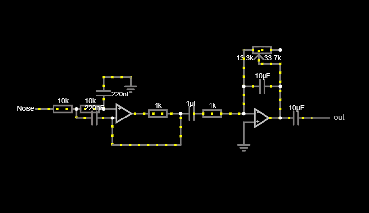
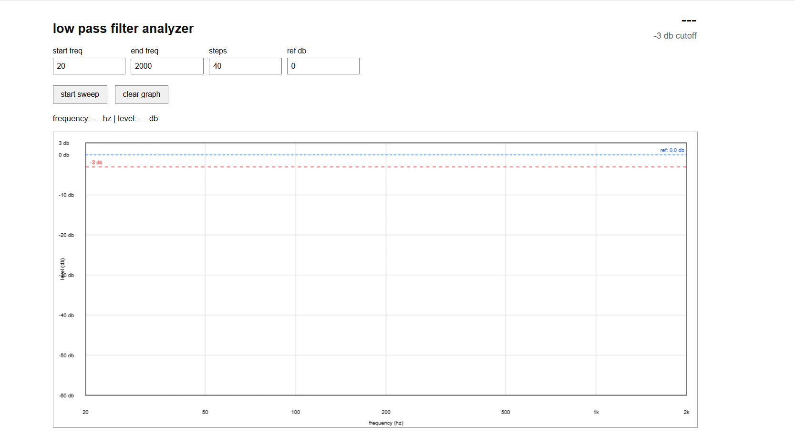
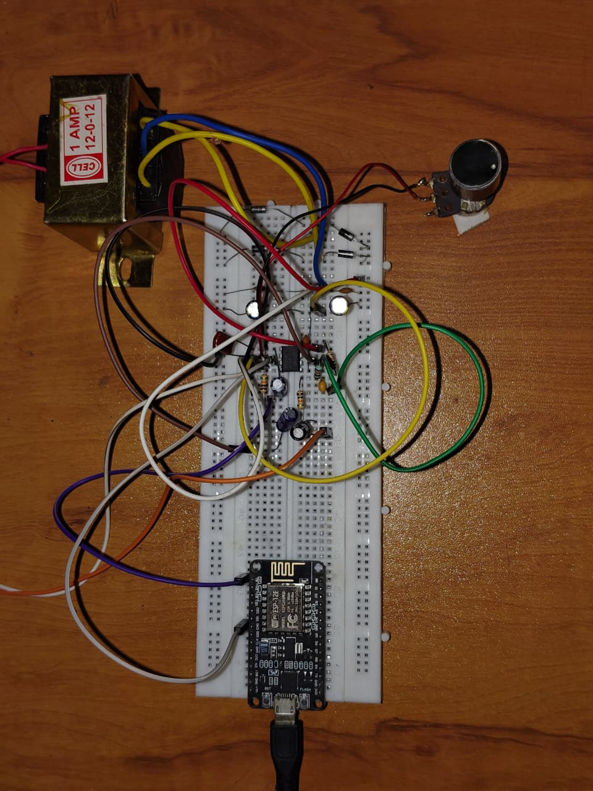

# Low Pass Filter Analyzer 📉

DIY active low-pass filter analyzer using NodeMCU ESP8266 and a custom web interface.

## Features
- Real-time frequency sweep
- Live graph plotting
- RMS-based signal measurement
- Adjustable sweep range

## Hardware Used
- NodeMCU ESP8266
- JRC4558 Op-Amp
- RC Filter Network

### Circuit Diagram

### Analyzer Interface

## Hardware

## Future Improvements
- Buffered ADC input
- Better calibration
- Improved RMS accuracy
